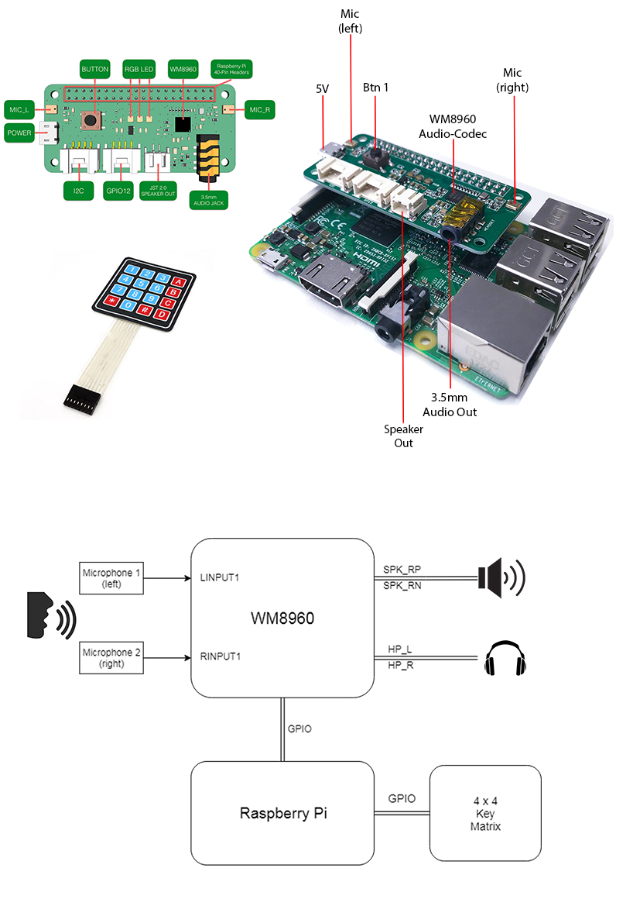
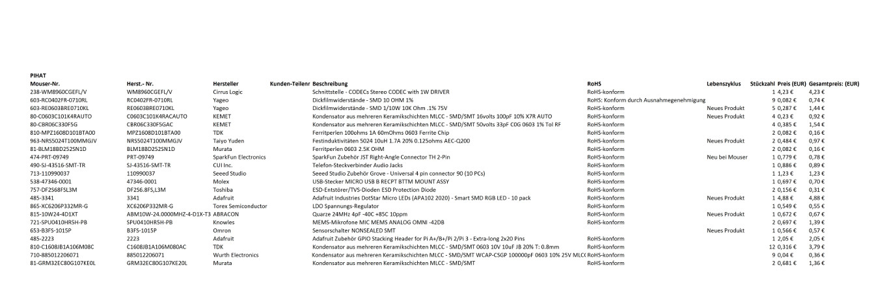

# Voice Modulator - Wiki

#### Wiki

1. [Bilder](#Bilder)
2. [Projekphasen](#Projekphasen)
   1. [Konzeptphase](#Konzeptphase)
   2. [Definitionsphase](#Definitionsphase)
   3. [Entwurfsphase](#Entwurfsphase)
	 4. [Fertigungsphase](#Fertigungsphase)
	 5. [Wartungsphase](#Wartungsphase)
    

## Bilder <a name="Bilder"></a>


# Projekphasen <a name="Projekphasen"></a>

## Konzeptphase <a name="Konzeptphase"></a>

### Projekt-Idee <a name="Projekt-Idee"></a>

Der VoiceModulator ist eine Fortsetzung des Moduls Leiterplattenentwurf vom Wintersemester 17/18 an der HTW Berlin. In dem Modul haben wir die Leiterplatte in KiCAD entworfen und danach im Labor entwickelt und überprüft. Darauf folgend haben wir uns mit der Bestückung der Leiterplatte beschäftigt.

Das VoiceModulator Projekt wurde im Sommersemester 2018 im Kurs Project Computer Systems Engineering umgesetzt, unter der Betreuung von Prof. Dr. Frank Bauernöppel und Prof. Dr.-Ing. Carsten Thomas.

VoiceModulator ist ein Produkt, das Stimme aufnehmen kann, sie verändern und mit ihr auf interessanten Weise spielen. Mit dem VoiceModulator kann der Benutzer seine Stimme aufnehmen, modulieren, und sie wiedergeben.

Mit der eingebauten Tastatur kann der Benutzer zwischen folgenden Effekten wählen:  
```
- Reverb
- Reverse
- Pitch 
- Pikachu
- Satan
```
Zusätzlich kann der Benutzer die Lautstärke ändern.


### Lastenheft <a name="Lastenheft"></a>

Der VoiceModulator soll eine Stimme aufnehmen und diese nach Modulierung mittels eines vorgewählten Effektes wiedergeben.

#### Muss- Kriterien <a name="Muss--Kriterien"></a>

```
A.1.1 Der VoiceModulator soll über eine Tastatur bedient werden.
   A.1.1.0 Der Benutzer soll das Produkt mittels Ein-/Ausziehen des MicroUSB-Steckers betreiben.
   A.1.1.1 Der Benutzer soll über eine Taste zum Start der Aufnahme und eine zum Halt der Aufnahme verfügen.
   A.1.1.2 Zweit Taster sollen zur Einstellung der Lautstärke dienen.
   A.1.1.3 Jeder Effekt soll über eine eigene Taste verfügbar sein.

A.1.2 Der VoiceModulator muss mittels 2 Mikrofons Stimme aufnehmen.  
A.1.3 Der VoiceModulator muss die aufgenommene Stimme mit Effekten modulieren.
   A.1.3.1 Dem Benutzer soll die Moöglichkeit gegeben werden, zwischen Pitch- ,Reverb- ,Reverse- ,Pikachu- oder Satan-Effekt auszuwählen.

A.1.4 Der VoiceModulator muss die modulierte Stimme, entsprechend dem gewählten Effekt, wiederspielen.  
A.1.5 Die Wiedergabe derselben Stimme soll bis zum nächsten neuen Aufnahme möglich sein.
A.1.6 Die Stromversorgung muss über einen externen Akku erfolgen.
A.1.7 Die eingebauten LEDs sollen als Anzeige des laufenden Aufnahmevorganges innerhalbdes Aufnahmfensters blinken.
```


#### Kann- Kriterien <a name="Kann--Kriterien"></a>
```
A.2.0 Der VoiceModulator sollte in einer kubischen Box eingebaut werden.  
A.2.1 Der Effektauswahl sollte durch schütteln ersetzt werden. Somit sollte nach Aufnahme der Stimme ein Effekt zufällig vom System gewählt werden.  
A.2.2 Das Produkt sollte mit zusätzlichen Effekten erweitert werden.  
A.2.3 In abhängigkeit vom gewählten Effekt sollte ein zugehöriges Display farbig leuchten, entsprechend der Waveform der Aufnahme.  
A.2.4 Der VoiceModulator verfügt über 2 Mikrofons. Ein Algorithmus sollte implementiert werden, der dank der Stereo-Funktionalität den Mikrofons, die Stimme aufklärt. Nebengeräusche und Hintergrundstimmen sollten ausgelöscht werden.
```

## Definitionsphase <a name="Definitionsphase"></a>

### Pflichtenheft <a name="Pflichtenheft"></a>

```
B.0.0 Das Produkt Muss als Raspberry Pi extension board (HAT) implementiert werden.

B.1.0
   B.1.1.0 Das Produkt wird mit Stromanschluss ein-/ausgeschaltet.
   B.1.1.1 Die Lautstärke der Wiedergabe soll mittels einer Taste einstellbar sein. Der Einstellungsvorgang befindet sich in einer Schleife, die die Tonstärke ständig inkrementiert. Wenn der maximale Wert erreicht wird, wird er wieder auf den minimalen gesetzt und der Vorgang neugestartet.
   B.1.1.3 Dem User stehen Tasten zur Verfügung, die voreingestellte Effekten entsprechen müssen. Jede Taste soll ein Effekt entsprechen.

B.1.2
   B.1.2.1 Bedingung: wenn der User die A-Taste zur Aufnahme betätigt, muss der Aufnahme-Vorgang gestartet werden. Sobald die B-Taste gedrückt wird, muss die Aufnahme beenden.
      B.1.2.1.1 Die länge der Aufnahme soll maximal 10s betragen. Nach Überschreitung dieses Zeitfensters wird die Aufnahme automatisch beendet.

   B.1.2.2 Die Stimme muss mithilfe des Audio-Codec Chips zu einem Audio-Datei konvertiert werden.  
   B.1.2.3 Das Sample wird auf den Hauptspeicher der RaspberryPi gespeichert.  
   B.1.2.4 Die Auflösung & Format der Aufnahme soll ~1096 kbps FLAC sein.

B.1.3
   B.1.3.1 Durch vorprogrammierte Software muss das Sample verarbeitet werden.
      B.1.3.1.0 Nach dem Effekt-Auswahl wird die Modulierung gestartet.
      B.1.3.1.1 Die mögliche Effekte sollen Pitch-changer, Reverb, Reverse, Pikachu oder Satan sein.

B.1.4
   B.1.4.1 Das HAT stellt 2 Möglichkeiten zur Wiedergabe zur Verfügung.
      B.1.4.1.1 Ein 3.5mm Anschluss dient zur Verbindung mit einer externen Anlage.
      B.1.4.1.2 Dank der eingebaute Verstärker kann die Verarbeitete Stimme mithilfe eines angeschlossenen Lautsprechers abgespielt werden.

B.1.5
   B.1.5.1 Bedingung: nach erfolgreiche Aufnahme und Modulierung muss der User eine Taste drücken um die Wiedergabe zu starten.
      B.1.5.1.1 Wird die Taste nach der ersten Wiedergabe wieder betätigt, so erfolgt eine Wiederholung derselben Aufnahme.
      B.1.5.1.2 Die vorherige Aufnahme muss gelöscht werden erst nachdem die Taste zur Aufnahme gedrückt wird.
```


### UML-Zustandsdiagramm <a name="UML-Zustandsdiagramm"></a>


### Produkt Module <a name="Produkt-Module"></a>

Unser Produkt besteht aus folgendem Hardware:
```
1. Raspberry PI 3  
2. SeeedStudio 2-Mic RasPi HAT
3. NodeMCU v1.0 ESP8266 MCU
4. 4 * 4 Matrix Tastatur 
5. 1W Lautsprecher  
6. 4GB SD karte
```
Für die Entwicklung benutzt: (Software)
```
1. Raspbian Stretch Lite  
2. Python 2.7 & 3.0  
3. WM8960 Treiber  
4. Git  
5. SoX - Audio Bibliothek
6. HTW Projektmanagement Server
```


### Testspezifikationen <a name="Testspezifikationen"></a>
```
1.Modulation von existierenden Datei
   Der erste Schritt ist auf einer, sich im Speicher befindenden Datei Modulationen durchzuführen.

2.Modulation von aufgenommenen Datei
   Der zweite Schritt ist Stimme aufzunehmen und darauf Modulationen durchzuführen.

3.Modulationskette in einem Datei
   Der dritte Schritt ist Schritt 2 + mehrfach nacheinander geketteten Modulationen.

4.Lautsprecher-Anschluss & Verstärker
   Der letzte Schritt besteht daraus, der Lautsprecher anzuschließen und korrekt zu betreiben.
```

### Glossar <a name="Glossar"></a>
```
1. Modulation
   Modulation beschreibt einen vorbereiteten Übergang von einer Tonart zu einer anderen. Es ist das Variiren der Eigenschaften einer Audio-Wellenform.

2. Pitch
   Pitch ist die veränderung der Frequenz eines aufgenommenen Klangstückes.

3. Reverb(Effekt)
   Reverb ist die Laufzeitverzögerung des akustichen Signals. Der Effekt erzeugt eine oder mehrere verzögerte Kopien des Eingangsignals, wodurch einen echoähnlichen Klang erzeugt wird.

4. Reverse(Effekt)
   Reverse Effekt ist, wenn der Ton rückwärts abgespielt wird.

5. Pikachu - Effekt
   Der Pikachu-Effekt ist die Veränderung der Aufnahme durch Beschleunigung und Frequenzerhöhung.

6. Satan - Effekt
Der Satan-Effekt haben wir die Veränderung der Aufnahme durch Verzögerung und Frequenzabsenkung benannt.

7. Sample(Musik)
   Sample/sampling - der Vorgang, einen Teil einer Aufnahme in einem neuen Kontext zu verwenden. Diese Aufnahme wird digitalisiert und gespeichert, sodass sie weiterverarbeitet werden kann.

8. Waveform
   Waveform/Wellenform ist die Gestalt und Form des zeitlichen Verlaufs der Veränderung der Amplitude einer Aufnahme.
```

## Entwurfsphase <a name="Entwurfsphase"></a>

### Blockschaltbild <a name="Blockschaltbild"></a>



## Fertigungsphase <a name="Fertigungsphase"></a>

### BOM (Umsetzung) <a name="BOM-Umsetzung"></a>



## Wartungsphase <a name="Wartungsphase"></a>

### Wartung und Erweiterungen <a name="Wartung-und-Erweiterungen"></a>

#### perfektionierende Wartung <a name="perfektionierende-Wartung"></a>
```
- die Baud-Rate der Datenübertragung vom Arduino-Board wird zu 115200 statt 9600  
- Implementierung von 2 weiteren Effekten.
```

#### adaptive Wartung <a name="adaptive-Wartung"></a>
```
- die LEDs leuchten farbig(kuze grüne welle) wenn das Produkt nach Anschalten bereit zur Aufnahme ist.  
- die LEDs leuchten farbig(wechselnd in Rot, Grün und Gelb) solange die Aufnahme läuft.  
- die LEDs leuchten farbig(einmalig in Rot, Grün und Gelb) wenn der Benutzer Effekte auswählen kann.
```

### Testdurchführungen <a name="Testdurchführungen"></a>

#### 1.Modulation von existierenden Datei <a name="1Modulation-von-existierenden-Datei-1"></a>
```
- Die Datei befindet sich im Speicher des Raspberry-Pi's im .mp3 Format.  
- Mittels Command Line Interface wird ein Effekt von der SoX Bibliothek verwendet.  
- Die Modulation ergibt eine neue Datei mit anderem Namen und speichert sie in derselben Ordner.  
- Mittels Command Line und ~aplay Befehl wird die modulierte Datei wiedergespielt.  
- Kopföhrer sind in dieser Phase benutzt. Lautsprecher ist nicht angeschlossen.
```


#### 2.Modulation von aufgenommenen Datei <a name="2Modulation-von-aufgenommenen-Datei-2"></a>
```
- Die Implementierung des Arduino-boards und Tastatur erfolgt in diesem Schritt.  
- Eine Taste dient zum Starten der Aufnahme  
- Nach 10 Sekunden hört die Aufnahme automatisch auf.  
- Die Aufnahme wird im Speicher gespeichert und überschreibt existierenden Datei, da derselben Name für eine neue Aufnahme benutzt wird.  
- Mittels Command Line Interface wird ein Effekt von der SoX Bibliothek verwendet.  
- Mittels Command Line und ~aplay Befehl wird die modulierte Datei wiedergespielt.  
- Tastatur-Tasten werden in diesem Schritt zum Aufnahme-Befehl & Wiedespielen-Befehl gemappt.
```


#### 3.Modulationskette in einem Datei <a name="3Modulationskette-in-einem-Datei-3"></a>
```
- Nach einer fehlerfreien Aufnahme werden mehrere Effekte ausgewählt.  
- Mittels Command Line Interface werden diese angewendet.  
- Nach fehlerfreien und korrekten Ausführung und Wiedergabe der Modulierten Datei, werden mehrere Tasten der Tastatur zu Effekten gemappt.
```


#### 4.Lautsprecher-Anschluss & Verstärker <a name="4Lautsprecher-Anschluss-38-Verstärker-4"></a>
```
- Der Lautsprecheranschluss wird benutzt um einen kleinen Lautsprecher anzuschliessen.  
- Mittels ALSA-Mixer erfolgt eine Einstellung der Klangstärke.  
- Ein Script wird benutzt um diese Einstellungen im Speicher abzulagern.  
- Im Fall eines Neu-Starts werden diese Einstellungen geladen und angewendet.  
- Zwei Tasten von der Tastatur werden benutzt um die Lautstärke der Wiedergabe einzustellen
```
